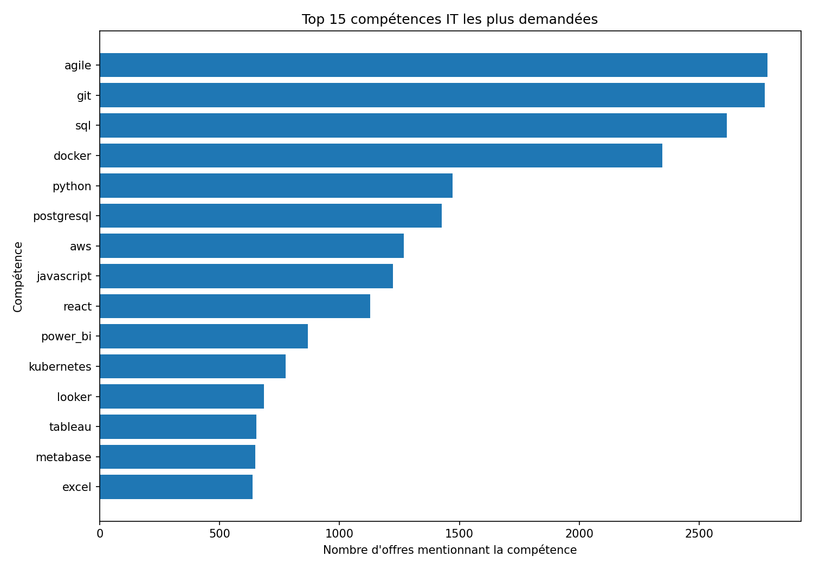
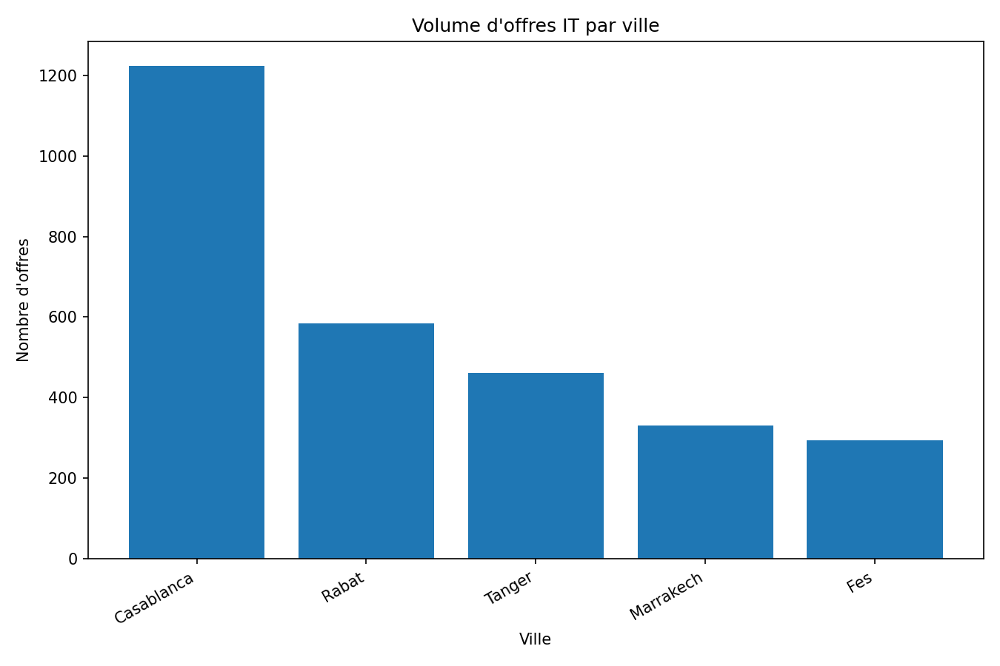
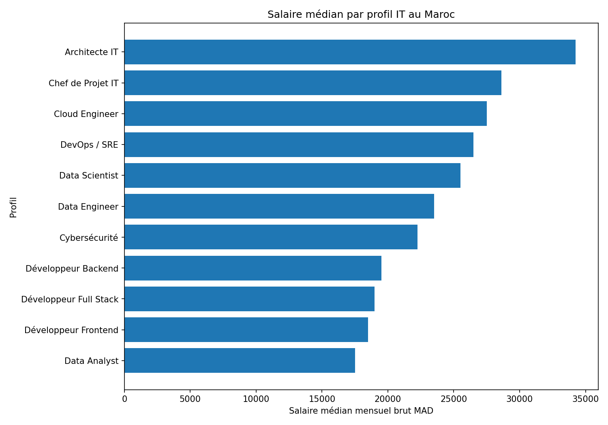
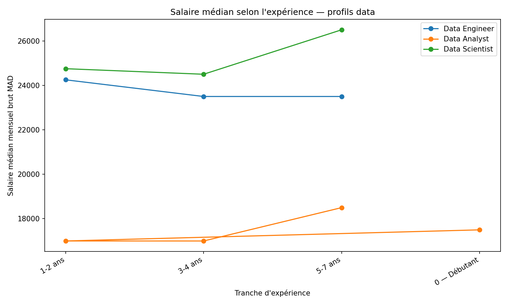
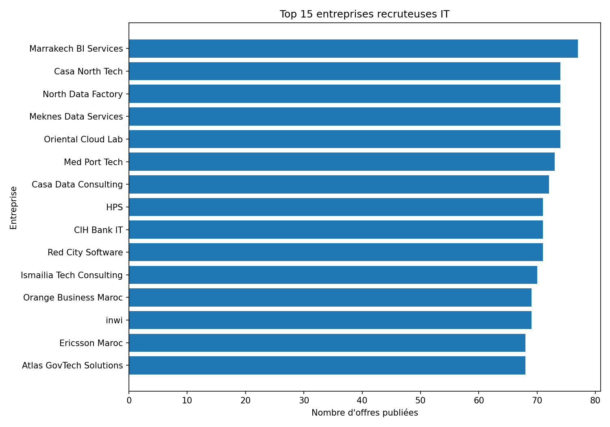

# Analyse du marché de l'emploi IT au Maroc
## Mexora RH Intelligence — Étape 3

Ce document contient les requêtes DuckDB, les résultats sous forme de tableaux et les interprétations associées aux cinq questions analytiques du projet.

## Question 1 — Quelles compétences sont les plus demandées au Maroc en IT ?

### Requête SQL

```sql
-- Question 1 : Top 20 compétences toutes offres confondues
    SELECT
        famille,
        competence,
        nb_offres_mentionnent,
        pct_offres_total,
        rang_dans_profil
    FROM read_parquet('C:/Users/Surface PC/OneDrive/Desktop/mexora_rh_lake/data_lake_mexora_rh/gold/top_competences.parquet')
    WHERE profil = 'tous'
    ORDER BY nb_offres_mentionnent DESC
    LIMIT 20;
    


    -- Question 1 : Top 5 compétences par profil data
    SELECT
        profil,
        famille,
        competence,
        nb_offres_mentionnent,
        rang_dans_profil
    FROM read_parquet('C:/Users/Surface PC/OneDrive/Desktop/mexora_rh_lake/data_lake_mexora_rh/gold/top_competences.parquet')
    WHERE profil IN ('Data Engineer', 'Data Analyst', 'Data Scientist')
      AND rang_dans_profil <= 5
    ORDER BY profil, rang_dans_profil;
```

### Résultat

| famille | competence | nb_offres_mentionnent | pct_offres_total | rang_dans_profil |
| --- | --- | --- | --- | --- |
| methodologies | agile | 2784 | 55.68 | 1 |
| methodologies | git | 2773 | 55.46 | 2 |
| langages | sql | 2614 | 52.28 | 3 |
| cloud | docker | 2347 | 46.94 | 4 |
| langages | python | 1471 | 29.42 | 5 |
| databases | postgresql | 1426 | 28.52 | 6 |
| cloud | aws | 1267 | 25.34 | 7 |
| langages | javascript | 1223 | 24.46 | 8 |
| frameworks_web | react | 1127 | 22.54 | 9 |
| bi_analytics | power_bi | 869 | 17.38 | 10 |
| cloud | kubernetes | 776 | 15.52 | 11 |
| bi_analytics | looker | 684 | 13.68 | 12 |
| bi_analytics | tableau | 654 | 13.08 | 13 |
| bi_analytics | metabase | 650 | 13.0 | 14 |
| bi_analytics | excel | 638 | 12.76 | 15 |
| cloud | terraform | 616 | 12.32 | 16 |
| frameworks_web | spring | 559 | 11.18 | 17 |
| langages | java | 536 | 10.72 | 18 |
| data_engineering | airflow | 501 | 10.02 | 19 |
| data_engineering | spark | 498 | 9.96 | 20 |

### Visualisation



### Interprétation

Les compétences les plus demandées globalement sont agile (55.68% des offres), git (55.46% des offres), sql (52.28% des offres), docker (46.94% des offres), python (29.42% des offres).
Le marché marocain IT montre donc une forte demande sur les compétences transversales liées aux méthodes de travail, aux bases de données et à l’outillage technique.
SQL, Docker et Python ressortent comme des compétences centrales, ce qui confirme l’importance des profils capables de manipuler les données, déployer des applications et travailler dans des environnements modernes.
Pour les Data Engineer, les compétences dominantes sont : airflow, spark, python, sql, kafka. Pour les Data Analyst, les compétences dominantes sont : looker, tableau, metabase, power_bi, sql. Pour les Data Scientist, les compétences dominantes sont : scikit_learn, numpy, pandas, tensorflow, nlp.
Pour Mexora, ces résultats indiquent que les futurs recrutements data devront prioriser les compétences Python, SQL, cloud, data engineering et visualisation BI.

## Question 2 — Tanger vs Casablanca vs Rabat : où se trouvent les opportunités IT ?

### Requête SQL

```sql
-- Question 2 : Comparaison des principales villes IT
    WITH agg AS (
        SELECT
            ville,
            profil,
            SUM(nb_offres) AS nb_offres,
            SUM(nb_offres_remote_hybrid) AS nb_offres_remote,
            ROUND(
                SUM(nb_offres_remote_hybrid) * 100.0 / NULLIF(SUM(nb_offres), 0),
                2
            ) AS pct_remote
        FROM read_parquet('C:/Users/Surface PC/OneDrive/Desktop/mexora_rh_lake/data_lake_mexora_rh/gold/offres_par_ville.parquet')
        WHERE ville IN ('Casablanca', 'Rabat', 'Tanger', 'Marrakech', 'Fes', 'Fès')
        GROUP BY ville, profil
    )
    SELECT
        ville,
        profil,
        nb_offres,
        nb_offres_remote,
        pct_remote,
        RANK() OVER (
            PARTITION BY profil
            ORDER BY nb_offres DESC
        ) AS rang_ville
    FROM agg
    ORDER BY profil, rang_ville;
    


    -- Question 2 : Focus Tanger avec ratio vs Casablanca
    WITH agg AS (
        SELECT
            ville,
            profil,
            SUM(nb_offres) AS nb_offres,
            SUM(nb_offres_remote_hybrid) AS nb_offres_remote,
            ROUND(
                SUM(nb_offres_remote_hybrid) * 100.0 / NULLIF(SUM(nb_offres), 0),
                2
            ) AS pct_remote
        FROM read_parquet('C:/Users/Surface PC/OneDrive/Desktop/mexora_rh_lake/data_lake_mexora_rh/gold/offres_par_ville.parquet')
        WHERE ville IN ('Casablanca', 'Rabat', 'Tanger', 'Marrakech', 'Fes', 'Fès')
        GROUP BY ville, profil
    ),
    ref_casa AS (
        SELECT
            profil,
            nb_offres AS nb_offres_casablanca
        FROM agg
        WHERE ville = 'Casablanca'
    )
    SELECT
        t.profil,
        t.nb_offres,
        t.nb_offres_remote,
        t.pct_remote,
        ROUND(
            t.nb_offres * 100.0 / NULLIF(c.nb_offres_casablanca, 0),
            1
        ) AS pct_vs_casa
    FROM agg t
    LEFT JOIN ref_casa c
        ON t.profil = c.profil
    WHERE t.ville = 'Tanger'
    ORDER BY t.nb_offres DESC;
```

### Résultat

| ville | profil | nb_offres | nb_offres_remote | pct_remote | rang_ville |
| --- | --- | --- | --- | --- | --- |
| Casablanca | Architecte IT | 44.0 | 25.0 | 56.82 | 1 |
| Rabat | Architecte IT | 21.0 | 12.0 | 57.14 | 2 |
| Fes | Architecte IT | 14.0 | 13.0 | 92.86 | 3 |
| Tanger | Architecte IT | 13.0 | 6.0 | 46.15 | 4 |
| Marrakech | Architecte IT | 7.0 | 5.0 | 71.43 | 5 |
| Casablanca | Chef de Projet IT | 66.0 | 34.0 | 51.52 | 1 |
| Rabat | Chef de Projet IT | 26.0 | 16.0 | 61.54 | 2 |
| Tanger | Chef de Projet IT | 23.0 | 10.0 | 43.48 | 3 |
| Marrakech | Chef de Projet IT | 20.0 | 15.0 | 75.0 | 4 |
| Fes | Chef de Projet IT | 17.0 | 9.0 | 52.94 | 5 |
| Casablanca | Cloud Engineer | 67.0 | 42.0 | 62.69 | 1 |
| Rabat | Cloud Engineer | 39.0 | 23.0 | 58.97 | 2 |
| Tanger | Cloud Engineer | 32.0 | 16.0 | 50.0 | 3 |
| Marrakech | Cloud Engineer | 26.0 | 15.0 | 57.69 | 4 |
| Fes | Cloud Engineer | 6.0 | 5.0 | 83.33 | 5 |
| Casablanca | Cybersécurité | 51.0 | 32.0 | 62.75 | 1 |
| Rabat | Cybersécurité | 29.0 | 16.0 | 55.17 | 2 |
| Tanger | Cybersécurité | 13.0 | 8.0 | 61.54 | 3 |
| Marrakech | Cybersécurité | 9.0 | 5.0 | 55.56 | 4 |
| Fes | Cybersécurité | 8.0 | 5.0 | 62.5 | 5 |

### Visualisation



### Interprétation

La ville qui concentre le plus d’opportunités IT dans le périmètre analysé est Casablanca, avec 1223 offres.
Tanger représente 462 offres dans les profils étudiés, ce qui confirme l’existence d’un marché local, mais plus limité que Casablanca et Rabat.
Les profils les plus présents à Tanger sont notamment : Data Engineer, Data Analyst, Développeur Frontend, Développeur Full Stack, Développeur Backend.
Pour Mexora, basée à Tanger, cette situation implique deux options stratégiques : renforcer l’attractivité salariale locale ou ouvrir davantage le recrutement au remote/hybride depuis Casablanca et Rabat.
La part du remote/hybride permet aussi d’identifier les profils pour lesquels une stratégie de recrutement flexible peut compenser la taille plus réduite du bassin local.

## Question 3 — Quel est le salaire médian par profil IT au Maroc ?

### Requête SQL

```sql
-- Question 3 : Salaires médians par profil, toutes villes
    SELECT
        profil,
        SUM(nb_offres) AS nb_offres_total,
        SUM(nb_offres_avec_salaire) AS nb_avec_salaire,
        ROUND(
            SUM(nb_offres_avec_salaire) * 100.0 / NULLIF(SUM(nb_offres), 0),
            1
        ) AS pct_salaire_communique,
        ROUND(MEDIAN(salaire_median_mad), 0) AS salaire_median_mad,
        MIN(salaire_min_observe) AS salaire_plancher,
        MAX(salaire_max_observe) AS salaire_plafond
    FROM read_parquet('C:/Users/Surface PC/OneDrive/Desktop/mexora_rh_lake/data_lake_mexora_rh/gold/salaires_par_profil.parquet')
    GROUP BY profil
    ORDER BY salaire_median_mad DESC NULLS LAST;
    


    -- Question 3 : Salaires à Tanger vs médiane nationale
    WITH national AS (
        SELECT
            profil,
            ROUND(MEDIAN(salaire_median_mad), 0) AS salaire_median_national
        FROM read_parquet('C:/Users/Surface PC/OneDrive/Desktop/mexora_rh_lake/data_lake_mexora_rh/gold/salaires_par_profil.parquet')
        GROUP BY profil
    ),
    tanger AS (
        SELECT
            profil,
            SUM(nb_offres) AS nb_offres,
            ROUND(MEDIAN(salaire_median_mad), 0) AS salaire_median_mad,
            ROUND(MEDIAN(salaire_q1_mad), 0) AS salaire_q1_mad,
            ROUND(MEDIAN(salaire_q3_mad), 0) AS salaire_q3_mad
        FROM read_parquet('C:/Users/Surface PC/OneDrive/Desktop/mexora_rh_lake/data_lake_mexora_rh/gold/salaires_par_profil.parquet')
        WHERE ville = 'Tanger'
        GROUP BY profil
        HAVING SUM(nb_offres) >= 5
    )
    SELECT
        t.profil,
        t.nb_offres,
        t.salaire_median_mad,
        t.salaire_q1_mad,
        t.salaire_q3_mad,
        n.salaire_median_national,
        ROUND(
            t.salaire_median_mad - n.salaire_median_national,
            0
        ) AS ecart_vs_mediane_nationale
    FROM tanger t
    LEFT JOIN national n
        ON t.profil = n.profil
    ORDER BY t.salaire_median_mad DESC NULLS LAST;
```

### Résultat

| profil | nb_offres_total | nb_avec_salaire | pct_salaire_communique | salaire_median_mad | salaire_plancher | salaire_plafond |
| --- | --- | --- | --- | --- | --- | --- |
| Architecte IT | 142.0 | 116.0 | 81.7 | 34250.0 | 22000.0 | 55000.0 |
| Chef de Projet IT | 210.0 | 161.0 | 76.7 | 28626.0 | 15000.0 | 45004.0 |
| Cloud Engineer | 257.0 | 188.0 | 73.2 | 27500.0 | 13997.0 | 44000.0 |
| DevOps / SRE | 388.0 | 308.0 | 79.4 | 26500.0 | 13997.0 | 42000.0 |
| Data Scientist | 389.0 | 307.0 | 78.9 | 25500.0 | 13000.0 | 40003.0 |
| Data Engineer | 630.0 | 494.0 | 78.4 | 23500.0 | 11999.0 | 38005.0 |
| Cybersécurité | 170.0 | 137.0 | 80.6 | 22251.0 | 11999.0 | 38000.0 |
| Développeur Backend | 581.0 | 441.0 | 75.9 | 19500.0 | 8996.0 | 33005.0 |
| Développeur Full Stack | 615.0 | 465.0 | 75.6 | 18997.0 | 8996.0 | 34000.0 |
| Développeur Frontend | 640.0 | 505.0 | 78.9 | 18500.0 | 8000.0 | 34000.0 |
| Data Analyst | 763.0 | 588.0 | 77.1 | 17496.0 | 8000.0 | 30002.0 |

### Visualisation



### Interprétation

Les profils les mieux rémunérés au niveau national sont : Architecte IT (34250 MAD), Chef de Projet IT (28626 MAD), Cloud Engineer (27500 MAD), DevOps / SRE (26500 MAD), Data Scientist (25500 MAD).
Les salaires médians permettent de distinguer les profils stratégiques, notamment les profils Data, Cloud, DevOps et Architecture.
Pour Tanger, l’analyse est importante car Mexora y est implantée.
Data Engineer à Tanger est supérieur à la référence nationale de 2000 MAD; Data Scientist à Tanger est équivalent à la référence nationale; Data Analyst à Tanger est inférieur à la référence nationale de 996 MAD.
Ces résultats doivent aider Mexora à fixer des fourchettes salariales réalistes : rester trop bas par rapport à la médiane nationale risque de limiter l’attractivité, tandis qu’un positionnement légèrement supérieur peut accélérer le recrutement de profils rares.

## Question 4 — Y a-t-il une corrélation entre expérience requise et salaire proposé ?

### Requête SQL

```sql
-- Question 4 : Corrélation expérience / salaire par profil
    WITH base AS (
        SELECT
            profil_normalise AS profil,
            experience_min_ans,
            salaire_median_mad,
            CASE
                WHEN experience_min_ans = 0 THEN '0 — Débutant'
                WHEN experience_min_ans BETWEEN 1 AND 2 THEN '1-2 ans'
                WHEN experience_min_ans BETWEEN 3 AND 4 THEN '3-4 ans'
                WHEN experience_min_ans BETWEEN 5 AND 7 THEN '5-7 ans'
                WHEN experience_min_ans >= 8 THEN '8+ ans Senior'
                ELSE 'Non précisé'
            END AS tranche_experience
        FROM read_parquet('C:/Users/Surface PC/OneDrive/Desktop/mexora_rh_lake/data_lake_mexora_rh/silver/offres_clean/offres_clean.parquet')
        WHERE salaire_connu = TRUE
          AND experience_min_ans IS NOT NULL
          AND salaire_median_mad IS NOT NULL
    ),
    agregation AS (
        SELECT
            profil,
            tranche_experience,
            COUNT(*) AS nb_offres,
            ROUND(MEDIAN(salaire_median_mad), 0) AS salaire_median,
            ROUND(AVG(experience_min_ans), 2) AS experience_moyenne
        FROM base
        GROUP BY profil, tranche_experience
    ),
    correlation AS (
        SELECT
            profil,
            ROUND(CORR(experience_min_ans, salaire_median_mad), 3) AS correlation_pearson
        FROM base
        GROUP BY profil
    )
    SELECT
        a.profil,
        a.tranche_experience,
        a.nb_offres,
        a.salaire_median,
        c.correlation_pearson
    FROM agregation a
    LEFT JOIN correlation c
        ON a.profil = c.profil
    ORDER BY
        a.profil,
        CASE a.tranche_experience
            WHEN '0 — Débutant' THEN 0
            WHEN '1-2 ans' THEN 1
            WHEN '3-4 ans' THEN 2
            WHEN '5-7 ans' THEN 3
            WHEN '8+ ans Senior' THEN 4
            ELSE 5
        END;
```

### Résultat

| profil | tranche_experience | nb_offres | salaire_median | correlation_pearson |
| --- | --- | --- | --- | --- |
| Architecte IT | 0 — Débutant | 36 | 35750.0 | 0.003 |
| Architecte IT | 1-2 ans | 24 | 34500.0 | 0.003 |
| Architecte IT | 3-4 ans | 42 | 31750.0 | 0.003 |
| Architecte IT | 5-7 ans | 38 | 36504.0 | 0.003 |
| Chef de Projet IT | 0 — Débutant | 33 | 28500.0 | -0.053 |
| Chef de Projet IT | 1-2 ans | 36 | 29500.0 | -0.053 |
| Chef de Projet IT | 3-4 ans | 37 | 28500.0 | -0.053 |
| Chef de Projet IT | 5-7 ans | 59 | 28000.0 | -0.053 |
| Cloud Engineer | 1-2 ans | 44 | 27750.0 | -0.024 |
| Cloud Engineer | 3-4 ans | 59 | 27000.0 | -0.024 |
| Cloud Engineer | 5-7 ans | 69 | 27500.0 | -0.024 |
| Cybersécurité | 0 — Débutant | 33 | 24500.0 | -0.068 |
| Cybersécurité | 1-2 ans | 30 | 20750.0 | -0.068 |
| Cybersécurité | 3-4 ans | 34 | 21500.0 | -0.068 |
| Cybersécurité | 5-7 ans | 49 | 22500.0 | -0.068 |
| Data Analyst | 0 — Débutant | 99 | 17500.0 | 0.033 |
| Data Analyst | 1-2 ans | 117 | 17000.0 | 0.033 |
| Data Analyst | 3-4 ans | 171 | 16999.0 | 0.033 |
| Data Analyst | 5-7 ans | 151 | 18500.0 | 0.033 |
| Data Engineer | 1-2 ans | 76 | 24250.0 | 0.024 |

### Visualisation



### Interprétation

La corrélation de Pearson mesure la relation entre l’expérience minimale demandée et le salaire proposé.
Une valeur proche de 1 indique une relation positive forte ; une valeur proche de 0 indique une relation faible.
Les profils présentant les corrélations les plus importantes sont : Data Scientist : corrélation faible (0.051), Data Analyst : corrélation faible (0.033), Data Engineer : corrélation faible (0.024), Architecte IT : corrélation faible (0.003), Développeur Frontend : corrélation nulle ou négative (-0.001).
Lorsque la corrélation est forte ou modérée, cela signifie que les salaires progressent avec l’expérience.
Lorsque la corrélation est faible, le salaire dépend probablement d’autres facteurs : rareté des compétences, ville, type de contrat, entreprise recruteuse ou technologie demandée.
Pour Mexora, cette analyse permet de mieux calibrer les offres salariales selon le niveau d’expérience réellement attendu.

## Question 5 — Quelles entreprises recrutent le plus ? Qui sont les concurrents de Mexora ?

### Requête SQL

```sql
-- Question 5 : Top 20 entreprises recruteuses
    -- Mexora Analytics est exclue car l'objectif est d'identifier
    -- les recruteurs concurrents sur le marché du talent.
    SELECT
        entreprise,
        ville,
        nb_offres_publiees,
        nb_profils_differents,
        salaire_moyen_propose,
        RANK() OVER (
            ORDER BY nb_offres_publiees DESC
        ) AS rang_recruteur
    FROM read_parquet('C:/Users/Surface PC/OneDrive/Desktop/mexora_rh_lake/data_lake_mexora_rh/gold/entreprises_recruteurs.parquet')
    WHERE entreprise <> 'Mexora Analytics'
    ORDER BY nb_offres_publiees DESC
    LIMIT 20;
    


    -- Question 5 : Concurrents directs de Mexora à Tanger sur les profils data
    SELECT
        entreprise,
        nb_offres_publiees,
        profils_recrutes,
        salaire_moyen_propose,
        CASE
            WHEN salaire_moyen_propose > 20000 THEN 'Compétiteur fort'
            WHEN salaire_moyen_propose > 12000 THEN 'Compétiteur moyen'
            ELSE 'Compétiteur faible'
        END AS niveau_competition
    FROM read_parquet('C:/Users/Surface PC/OneDrive/Desktop/mexora_rh_lake/data_lake_mexora_rh/gold/entreprises_recruteurs.parquet')
    WHERE ville = 'Tanger'
      AND entreprise <> 'Mexora Analytics'
      AND (
            list_contains(profils_recrutes, 'Data Engineer')
         OR list_contains(profils_recrutes, 'Data Analyst')
         OR list_contains(profils_recrutes, 'Data Scientist')
      )
    ORDER BY salaire_moyen_propose DESC NULLS LAST;
```

### Résultat

| entreprise | ville | nb_offres_publiees | nb_profils_differents | salaire_moyen_propose | rang_recruteur |
| --- | --- | --- | --- | --- | --- |
| Marrakech BI Services | Marrakech | 77 | 11 | 20773.0 | 1 |
| Oriental Cloud Lab | Oujda | 74 | 11 | 22402.0 | 2 |
| Meknes Data Services | Meknes | 74 | 11 | 21736.0 | 2 |
| North Data Factory | Tanger | 74 | 11 | 23737.0 | 2 |
| Casa North Tech | Mohammedia | 74 | 11 | 22915.0 | 2 |
| Med Port Tech | Tanger | 73 | 11 | 22008.0 | 6 |
| Casa Data Consulting | Casablanca | 72 | 11 | 23509.0 | 7 |
| Red City Software | Marrakech | 71 | 10 | 22705.0 | 8 |
| HPS | Casablanca | 71 | 11 | 22527.0 | 8 |
| CIH Bank IT | Casablanca | 71 | 11 | 21077.0 | 8 |
| Ismailia Tech Consulting | Meknes | 70 | 11 | 23207.0 | 11 |
| Orange Business Maroc | Casablanca | 69 | 10 | 21844.0 | 12 |
| inwi | Casablanca | 69 | 11 | 22179.0 | 12 |
| Atlas GovTech Solutions | Rabat | 68 | 11 | 21902.0 | 14 |
| Ericsson Maroc | Casablanca | 68 | 11 | 21970.0 | 14 |
| Mohammedia Data Lab | Mohammedia | 68 | 11 | 21912.0 | 14 |
| AgroTech Meknes | Meknes | 68 | 11 | 22582.0 | 14 |
| Souss Analytics | Agadir | 67 | 10 | 21091.0 | 18 |
| North Cloud Tetouan | Tetouan | 67 | 11 | 20991.0 | 18 |
| Oracle Maroc | Casablanca | 67 | 11 | 22614.0 | 18 |

### Visualisation



### Interprétation

Les entreprises qui recrutent le plus sur le marché IT marocain sont : Marrakech BI Services (77 offres), Oriental Cloud Lab (74 offres), Meknes Data Services (74 offres), North Data Factory (74 offres), Casa North Tech (74 offres).
Elles constituent des acteurs importants du marché du talent, car elles publient un volume élevé d’offres et couvrent plusieurs profils IT.
À Tanger, les concurrents directs de Mexora sur les profils data sont notamment : North Data Factory - Compétiteur fort, Tangier Software Hub - Compétiteur fort, Tanger Digital Services - Compétiteur fort, Med Port Tech - Compétiteur fort, TangerTech Solutions - Compétiteur fort.
Les entreprises avec un salaire moyen proposé élevé représentent une concurrence forte, car elles peuvent attirer plus facilement les candidats expérimentés.
Pour Mexora, il est recommandé de surveiller ces recruteurs, d’ajuster les fourchettes salariales et de mettre en avant des avantages différenciants : télétravail, évolution interne, formation data engineering et projets à forte valeur.
