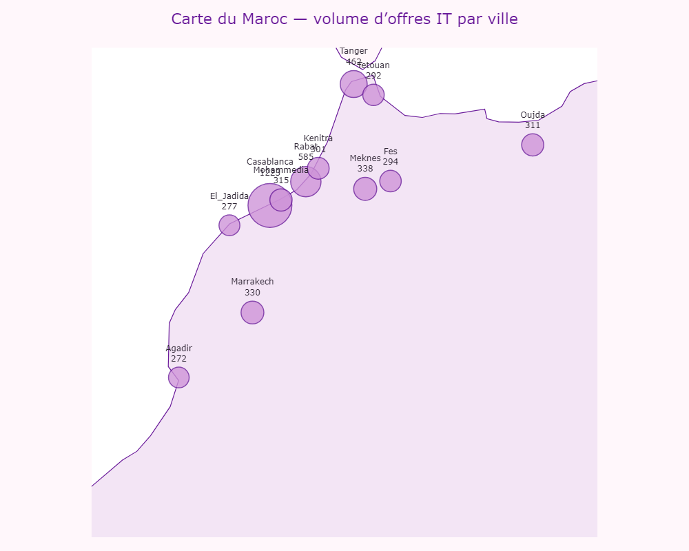
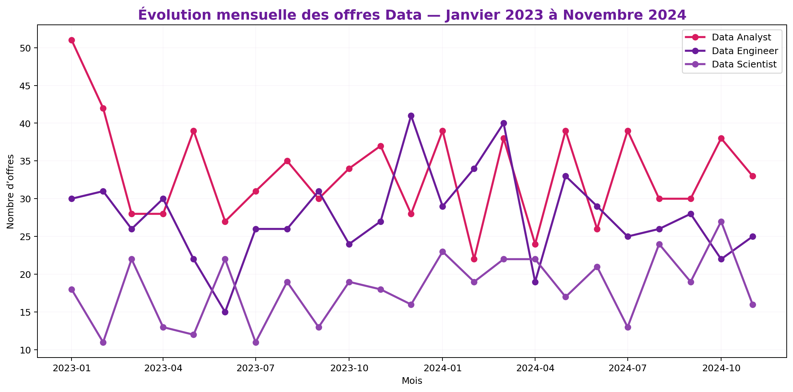
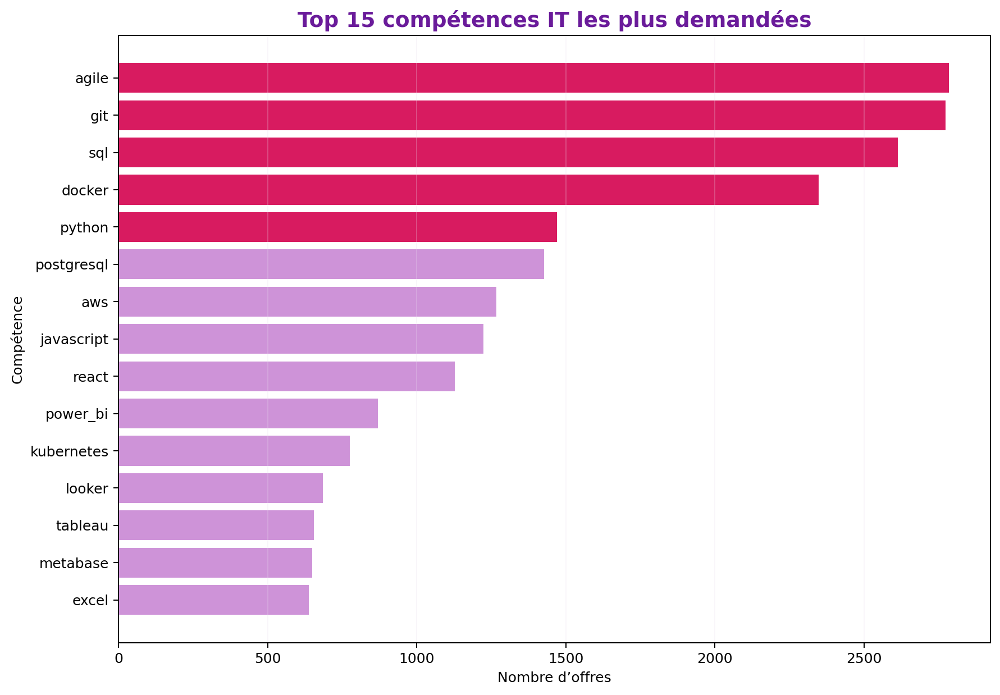
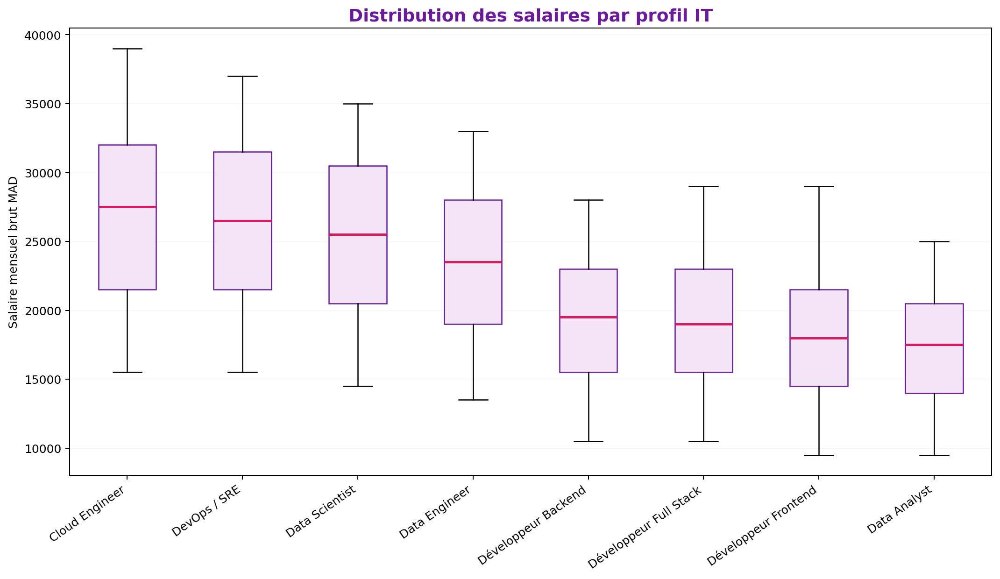

# RAPPORT : Analyse du Marché de l’Emploi IT au Maroc  
## Mexora RH Intelligence — Novembre 2024

---

## 1. Résumé exécutif

Mexora prépare le recrutement de nouveaux profils data dans un contexte où le marché marocain de l’emploi IT est fortement concentré autour de quelques pôles urbains et de compétences techniques clés. L’analyse réalisée sur **5000 offres d’emploi IT** met en évidence une forte demande pour les compétences liées aux méthodes projet, aux bases de données, au cloud, au développement et à la data.

### 5 chiffres clés

| Indicateur | Valeur |
|---|---:|
| Offres analysées | 5000 |
| Entreprises recruteuses | 82 |
| Villes couvertes | 12 |
| Offres remote ou hybrides | 61.0% |
| Salaires exploitables | 3873 offres |

La compétence la plus visible dans les offres est **agile**, mentionnée dans **55.68%** des offres. La ville la plus active est **Casablanca**, avec **1223 offres**.

### 3 recommandations prioritaires

1. **Prioriser le recrutement de Data Engineer et Data Analyst**, car ce sont les profils les plus directement alignés avec les besoins analytiques de Mexora.
2. **Positionner les salaires de Tanger au niveau du marché national**, voire légèrement au-dessus pour les profils rares.
3. **Adopter une stratégie de recrutement hybride**, combinant bassin local de Tanger et sourcing Casablanca/Rabat en remote.

### Horizon de mise en œuvre

| Horizon | Action |
|---|---|
| 0-1 mois | Finaliser les fiches de poste et fourchettes salariales |
| 1-3 mois | Lancer les recrutements Data Engineer et Data Analyst |
| 3-6 mois | Recruter le Data Scientist et renforcer la formation interne |

---

## 2. Méthodologie

L’analyse repose sur un Data Lake local construit en trois zones : Bronze, Silver et Gold. Les données sources simulent des offres d’emploi IT marocaines publiées entre **janvier 2023 et novembre 2024** sur trois sources : Rekrute, MarocAnnonce et LinkedIn Maroc.

### Sources et période

| Élément | Description |
|---|---|
| Sources | Rekrute, MarocAnnonce, LinkedIn Maroc |
| Période | Janvier 2023 à novembre 2024 |
| Volume | 5 000 offres |
| Données | Offres IT marocaines structurées et semi-structurées |

### Architecture utilisée

- **Bronze** : conservation des offres brutes au format JSON.
- **Silver** : nettoyage, normalisation et typage des données au format Parquet.
- **Gold** : tables analytiques prêtes pour DuckDB, dashboard et rapport.

### Limites et biais identifiés

Les données utilisées sont synthétiques mais construites pour reproduire des problèmes réalistes de scraping : salaires non communiqués, intitulés de poste hétérogènes, villes non standardisées, texte libre dans les descriptions et dates parfois incohérentes. Les résultats doivent donc être lus comme une **aide à la décision** et non comme une mesure officielle exhaustive du marché.

---

## 3. État du marché IT au Maroc

### Répartition géographique des opportunités

| ville | nb_offres | pct_remote_hybrid |
| --- | --- | --- |
| Casablanca | 1223.0 | 62.4 |
| Rabat | 585.0 | 60.7 |
| Tanger | 462.0 | 60.4 |
| Meknes | 338.0 | 62.4 |
| Marrakech | 330.0 | 57.3 |

Le marché IT est fortement concentré autour de **Casablanca**, suivie par **Rabat** et **Tanger**. Pour Mexora, basée à Tanger, cela signifie que le bassin local existe mais reste plus limité que les grands pôles nationaux. Le recours au recrutement hybride peut donc devenir un levier stratégique.

### Types de contrats dominants

| type_contrat | nb_offres | pct_offres |
| --- | --- | --- |
| CDI | 2445 | 48.9 |
| Stage | 671 | 13.4 |
| Contrat projet | 655 | 13.1 |
| CDD | 625 | 12.5 |
| Freelance | 604 | 12.1 |

Les contrats CDI restent structurants dans le marché IT, mais la présence de formats freelance, CDD, stage ou contrat projet montre que les entreprises adaptent leurs besoins selon la rareté des profils et la nature des projets.

### Tendance des profils data

Les profils Data Engineer, Data Analyst et Data Scientist présentent une demande continue sur la période étudiée. Cette stabilité confirme que le besoin de compétences data n’est pas ponctuel mais structurel.

---

## 4. Compétences les plus demandées

### Top 10 compétences toutes offres confondues

| famille | competence | nb_offres_mentionnent | pct_offres_total |
| --- | --- | --- | --- |
| methodologies | agile | 2784 | 55.68 |
| methodologies | git | 2773 | 55.46 |
| langages | sql | 2614 | 52.28 |
| cloud | docker | 2347 | 46.94 |
| langages | python | 1471 | 29.42 |
| databases | postgresql | 1426 | 28.52 |
| cloud | aws | 1267 | 25.34 |
| langages | javascript | 1223 | 24.46 |
| frameworks_web | react | 1127 | 22.54 |
| bi_analytics | power_bi | 869 | 17.38 |

Les compétences les plus demandées combinent trois familles : méthodologies de travail, langages et cloud/data engineering. La présence de **SQL**, **Docker**, **Python**, **AWS** et **PostgreSQL** indique que le marché valorise les profils capables de manipuler la donnée, industrialiser les traitements et travailler dans des environnements modernes.

Pour Mexora, les fiches de poste doivent donc clairement intégrer : Python, SQL, Docker, cloud, orchestration data et outils BI. Les compétences transversales comme Git, Agile et DevOps doivent être considérées comme des prérequis opérationnels.

---

## 5. Analyse salariale

### Salaires médians par profil

| profil | nb_offres_total | nb_avec_salaire | salaire_median_mad | salaire_plancher | salaire_plafond |
| --- | --- | --- | --- | --- | --- |
| Architecte IT | 142.0 | 116.0 | 34250.0 | 22000.0 | 55000.0 |
| Chef de Projet IT | 210.0 | 161.0 | 28626.0 | 15000.0 | 45004.0 |
| Cloud Engineer | 257.0 | 188.0 | 27500.0 | 13997.0 | 44000.0 |
| DevOps / SRE | 388.0 | 308.0 | 26500.0 | 13997.0 | 42000.0 |
| Data Scientist | 389.0 | 307.0 | 25500.0 | 13000.0 | 40003.0 |
| Data Engineer | 630.0 | 494.0 | 23500.0 | 11999.0 | 38005.0 |
| Cybersécurité | 170.0 | 137.0 | 22251.0 | 11999.0 | 38000.0 |
| Développeur Backend | 581.0 | 441.0 | 19500.0 | 8996.0 | 33005.0 |
| Développeur Full Stack | 615.0 | 465.0 | 18997.0 | 8996.0 | 34000.0 |
| Développeur Frontend | 640.0 | 505.0 | 18500.0 | 8000.0 | 34000.0 |
| Data Analyst | 763.0 | 588.0 | 17496.0 | 8000.0 | 30002.0 |

Les salaires les plus élevés concernent généralement les profils à forte expertise technique : architecture, cloud, DevOps, data engineering et data science. Les écarts sont également influencés par l’expérience, la ville, le type de contrat et la rareté des compétences.

### Focus Tanger

| profil | nb_offres | salaire_median_tanger | salaire_q1_mad | salaire_q3_mad | salaire_median_national | ecart_vs_national |
| --- | --- | --- | --- | --- | --- | --- |
| Architecte IT | 10.0 | 33500.0 | 30125.0 | 36375.0 | 34250.0 | -750.0 |
| DevOps / SRE | 39.0 | 28500.0 | 21250.0 | 31375.0 | 26500.0 | 2000.0 |
| Chef de Projet IT | 21.0 | 26498.0 | 24498.0 | 28750.0 | 28626.0 | -2128.0 |
| Cloud Engineer | 30.0 | 26125.0 | 22375.0 | 30875.0 | 27500.0 | -1375.0 |
| Data Scientist | 41.0 | 25500.0 | 21686.0 | 29126.0 | 25500.0 | 0.0 |
| Data Engineer | 70.0 | 25500.0 | 22375.0 | 28000.0 | 23500.0 | 2000.0 |
| Cybersécurité | 9.0 | 25499.0 | 20000.0 | 28877.0 | 22251.0 | 3248.0 |
| Développeur Frontend | 60.0 | 19500.0 | 16501.0 | 22500.0 | 18500.0 | 1000.0 |
| Développeur Full Stack | 53.0 | 19251.0 | 15999.0 | 22251.0 | 18997.0 | 254.0 |
| Développeur Backend | 50.0 | 18500.0 | 16750.0 | 23000.0 | 19500.0 | -1000.0 |
| Data Analyst | 66.0 | 16500.0 | 15999.0 | 18375.0 | 17496.0 | -996.0 |

Pour un **Data Engineer à Tanger**, la médiane observée est de **25500 MAD** avec une fourchette interquartile approximative entre **22375 MAD** et **28000 MAD**. Cette information doit servir de base aux packages salariaux de Mexora.

### Expérience et salaire

| profil | correlation_pearson |
| --- | --- |
| Data Scientist | 0.051 |
| Data Analyst | 0.033 |
| Data Engineer | 0.024 |
| Architecte IT | 0.003 |
| Développeur Frontend | -0.001 |
| DevOps / SRE | -0.014 |
| Développeur Full Stack | -0.023 |
| Cloud Engineer | -0.024 |
| Développeur Backend | -0.04 |
| Chef de Projet IT | -0.053 |

La corrélation entre expérience et salaire varie selon les profils. Lorsque la corrélation est élevée, l’expérience explique une part importante du niveau salarial. Lorsque la corrélation est plus faible, d’autres facteurs entrent en jeu : rareté technologique, entreprise recruteuse, ville, cloud, data engineering ou responsabilité projet.

---

## 6. Recommandations pour Mexora

### Profils prioritaires

| Priorité | Profil | Justification |
|---|---|---|
| 1 | Data Engineer | Profil essentiel pour structurer les pipelines, le Data Lake et les flux analytiques |
| 2 | Data Analyst | Profil nécessaire pour produire les analyses métier et accompagner les décisions RH/commerciales |
| 3 | Data Scientist | Profil à recruter après stabilisation des données et des besoins analytiques avancés |

### Fourchettes salariales recommandées

| Profil | Recommandation salariale mensuelle brute |
|---|---:|
| Data Engineer | Se positionner autour de la médiane Tanger, avec marge haute pour profils Spark/Airflow/Cloud |
| Data Analyst | Se positionner au niveau médian national si compétences BI avancées |
| Data Scientist | Prévoir une fourchette supérieure pour profils ML/NLP expérimentés |

### Concurrents directs à Tanger

| entreprise | nb_offres_publiees | salaire_moyen_propose | niveau_competition |
| --- | --- | --- | --- |
| North Data Factory | 74 | 23737.0 | Compétiteur fort |
| Tangier Software Hub | 55 | 23622.0 | Compétiteur fort |
| Tanger Digital Services | 63 | 22111.0 | Compétiteur fort |
| Med Port Tech | 73 | 22008.0 | Compétiteur fort |
| TangerTech Solutions | 63 | 21641.0 | Compétiteur fort |
| Detroit Data Morocco | 64 | 20925.0 | Compétiteur fort |

Les concurrents directs sont les entreprises de Tanger recrutant des profils Data Engineer, Data Analyst ou Data Scientist. Les compétiteurs forts doivent être surveillés en priorité, car ils peuvent attirer les mêmes candidats que Mexora.

### Recommandations opérationnelles

1. **Recruter d’abord un Data Engineer senior ou confirmé**, afin de renforcer la base technique du système analytique.
2. **Recruter ensuite un Data Analyst orienté BI**, capable de transformer les données Gold en tableaux de bord utiles aux métiers.
3. **Ouvrir les postes au mode hybride**, pour attirer des talents de Casablanca et Rabat sans limiter le recrutement au bassin local.
4. **Former en interne sur les compétences rares**, notamment orchestration data, cloud, Docker, SQL avancé et BI.
5. **Mettre en avant les projets à forte valeur**, car l’attractivité ne dépend pas uniquement du salaire mais aussi de la qualité des missions.

---

## Conclusion

Le marché IT marocain présente une forte demande pour les profils data, avec une concentration géographique autour de Casablanca et Rabat, mais une présence significative de Tanger. Pour Mexora, la stratégie recommandée consiste à combiner recrutement local, ouverture au remote/hybride, positionnement salarial compétitif et formation interne sur les compétences rares.